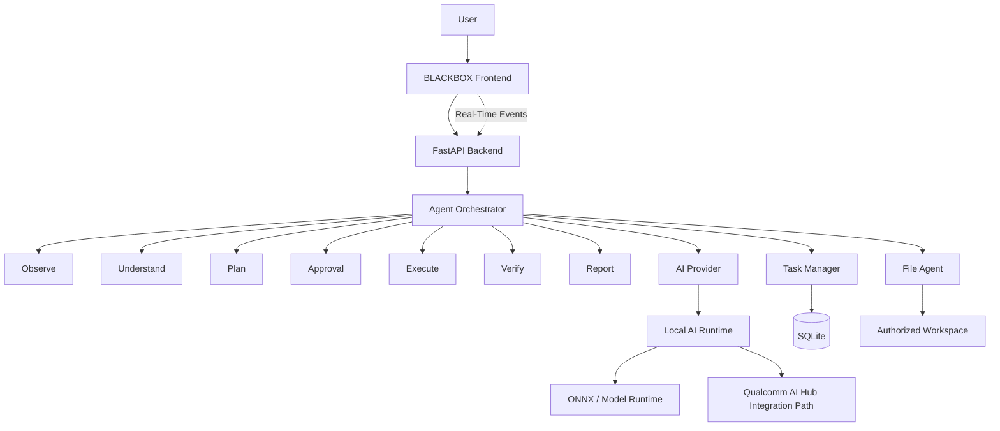

# BLACKBOX

### PRIVATE INTELLIGENCE. ON YOUR MACHINE.

**A privacy-first, local-first AI agent for controlled interaction with your computer workspace.**

BLACKBOX turns natural-language commands into a controlled execution pipeline:

**OBSERVE → UNDERSTAND → PLAN → APPROVE → EXECUTE → VERIFY → REPORT**

Instead of treating AI as a chatbot that only produces text, BLACKBOX gives AI a workspace it can reason about while keeping the human in control of consequential actions.

---

## Why BLACKBOX?

Most AI assistants follow a simple model:

```text
USER → PROMPT → AI → RESPONSE
```

BLACKBOX is designed around a different interaction model:

```text
USER
  ↓
COMMAND
  ↓
OBSERVE
  ↓
UNDERSTAND
  ↓
PLAN
  ↓
APPROVE
  ↓
EXECUTE
  ↓
VERIFY
  ↓
REPORT
```

The distinction is important:

> **AI can act. You still decide.**

BLACKBOX is designed around explicit authorization, controlled execution, verification, and traceable task history.

---

## Core Idea

### Give AI a workspace, not just a text box.

BLACKBOX allows an AI agent to work with an authorized workspace instead of operating only inside a conversational interface.

For example:

```text
"Organize my internship projects and create a project index."
```

BLACKBOX can:

1. Observe the authorized workspace.
2. Understand the requested task.
3. Generate an execution plan.
4. Present the planned actions.
5. Wait for user approval.
6. Execute the approved operations.
7. Verify the resulting workspace state.
8. Produce a structured report.
9. Record the task in local history.

---

# Key Features

## 🧠 Agentic Task Pipeline

BLACKBOX implements a staged task pipeline:

| Stage          | Purpose                                  |
| -------------- | ---------------------------------------- |
| **Observe**    | Inspect the authorized workspace         |
| **Understand** | Interpret the user's intent              |
| **Plan**       | Generate a structured execution plan     |
| **Approve**    | Request explicit user authorization      |
| **Execute**    | Perform approved operations              |
| **Verify**     | Validate the resulting state             |
| **Report**     | Present the outcome and task information |

---

## 🔐 Privacy & Controlled Execution

BLACKBOX is designed around local-first operation and explicit control.

Key principles include:

* Authorized workspace boundaries
* Explicit approval before modifications
* No silent destructive operations
* Path validation and sanitization
* Operation tracking
* Task history
* Verification after execution
* Cancellation support
* Separation between demonstration and real filesystem execution

The goal is not simply to make an AI agent more capable.

The goal is to make its capabilities **visible and controllable**.

---

## 📁 Workspace-Aware AI

BLACKBOX treats the user's workspace as an environment that the agent can reason about.

Example demonstration workspace:

```text
BLACKBOX-DEMO/
├── Internships/
│   ├── OASIS/
│   ├── ShadowFox/
│   ├── IBM/
│   └── Synent/
│
├── Projects/
│   └── AI/
│
├── Web/
├── DevOps/
└── Documents/
```

This enables task-oriented commands such as:

```text
Organize my internship projects
Create a project index
Inspect the workspace
Generate a summary
Verify the changes
```

---

# System Architecture



---

# Architecture Overview

BLACKBOX is divided into several major components.

### Frontend

The React frontend provides the user-facing control surface for:

* Commands
* Workspace
* Files
* Tasks
* Activity
* Agents
* Models
* Performance
* Settings
* Reports

The interface is designed as an operational workspace rather than a conventional chatbot.

### Backend

The FastAPI backend coordinates:

* Agent execution
* Workspace interaction
* Security controls
* Task management
* AI provider abstraction
* Approval flow
* Verification
* Real-time events
* Persistent task history

### Agent Orchestrator

The orchestrator coordinates the complete lifecycle of an operation:

```text
Observe
   ↓
Understand
   ↓
Plan
   ↓
Approve
   ↓
Execute
   ↓
Verify
   ↓
Report
```

### File Agent

Responsible for controlled workspace operations.

The file layer is separated from the reasoning layer so that AI planning does not automatically imply unrestricted filesystem access.

### Task Manager

Maintains task state and persistent history using SQLite.

### AI Provider

BLACKBOX uses an abstraction layer for AI providers so that model/runtime implementations can evolve without coupling the rest of the application to one specific provider.

---

# Real-Time Event Flow

BLACKBOX is designed to expose agent activity as it happens.

```text
Frontend
   │
   │ Command
   ▼
FastAPI
   │
   ▼
Agent Orchestrator
   │
   ├── Observe
   ├── Understand
   ├── Plan
   ├── Approval
   ├── Execute
   ├── Verify
   └── Report
          │
          ▼
     Event Stream
          │
          ▼
       Frontend
```

This allows the interface to represent the agent's progress instead of only displaying a final response.

---

# Security Model

BLACKBOX follows a controlled execution model.

### Workspace Authorization

Operations are constrained to an authorized workspace rather than allowing unrestricted filesystem access.

### Path Validation

Filesystem paths are validated to reduce the risk of unintended traversal outside the permitted workspace.

### Approval Gate

Actions that modify the workspace pass through an explicit approval stage.

```text
PLAN GENERATED
      ↓
USER REVIEW
      ↓
APPROVE / CANCEL
      ↓
EXECUTION
```

### Verification

Execution is followed by verification so the system can compare the intended operation with the resulting workspace state.

### Task History

Task information is persisted locally to provide traceability across operations.

---

# Technology Stack

| Layer                    | Technology                                |
| ------------------------ | ----------------------------------------- |
| Frontend                 | React + TypeScript                        |
| Build Tool               | Vite                                      |
| Styling                  | Tailwind CSS                              |
| Backend                  | Python + FastAPI                          |
| Database                 | SQLite                                    |
| Communication            | REST + Server-Sent Events                 |
| AI Runtime Architecture  | ONNX / local model-compatible abstraction |
| AI Integration Direction | Qualcomm AI Hub / Snapdragon AI PC        |
| Architecture             | Local-first / modular agent system        |

---

# Project Structure

```text
BLACKBOX/
│
├── frontend/
│   ├── src/
│   ├── public/
│   ├── package.json
│   └── vite.config.*
│
├── backend/
│   ├── app/
│   ├── requirements.txt
│   └── ...
│
├── docs/
│
├── README.md
├── .gitignore
└── .env.example
```

> The exact directory structure may evolve as the implementation develops.

---

# Getting Started

## Prerequisites

Install:

* Node.js
* npm
* Python 3.10+
* Git

---

## 1. Clone the Repository

```bash
git clone https://github.com/Akash-Selvaraj-R/BLACKBOX.git
cd BLACKBOX
```

---

# 2. Backend Setup

Navigate to the backend:

```bash
cd backend
```

Create a virtual environment:

### Windows

```cmd
python -m venv .venv
.venv\Scripts\activate
```

### macOS / Linux

```bash
python3 -m venv .venv
source .venv/bin/activate
```

Install dependencies:

```bash
pip install -r requirements.txt
```

Start the FastAPI server using the project's configured application entry point.

For example:

```bash
uvicorn app.main:app --reload
```

> If the application entry point differs in the current implementation, use the command documented by the backend configuration.

---

# 3. Frontend Setup

Open another terminal:

```bash
cd frontend
```

Install dependencies:

```bash
npm install
```

Start the development server:

```bash
npm run dev
```

The Vite development server will display the local URL in the terminal.

---

# Demo Workflow

BLACKBOX includes a demonstration workflow designed to showcase the complete agent lifecycle.

### Example Command

```text
Organize my internship projects and create a project index.
```

### Expected Flow

```text
COMMAND
   ↓
OBSERVE
   ↓
UNDERSTAND
   ↓
PLAN
   ↓
APPROVAL
   ↓
EXECUTE
   ↓
VERIFY
   ↓
REPORT
```

The demonstration emphasizes that the agent does not jump directly from a natural-language request to filesystem modification.

---

# AI Runtime Strategy

BLACKBOX is designed with an abstraction layer between the agent system and the underlying AI runtime.

```text
BLACKBOX
    ↓
AI Provider
    ↓
Local AI Runtime
    ↓
Model Runtime
    ↓
CPU / GPU / NPU
```

This architecture allows model and runtime implementations to evolve independently from the agent orchestration layer.

## Qualcomm AI Hub Alignment

BLACKBOX is designed with a path toward deployment and optimization of compatible AI models on Snapdragon-powered AI PCs.

Potential integration areas include:

* Qualcomm AI Hub-compatible model deployment
* ONNX-based model execution
* Hardware-aware model selection
* Local inference
* Snapdragon NPU optimization
* CPU/GPU/NPU execution strategies

**Important:** Qualcomm AI Hub/NPU-specific execution should be considered an integration and optimization path unless explicitly implemented and validated in the current build.

BLACKBOX does not claim Qualcomm certification, NPU execution, benchmark results, or hardware-specific performance unless those results have been independently verified.

---

# Why AI PCs?

AI PCs introduce local compute capabilities that can support AI workloads closer to the user.

For a system like BLACKBOX, local AI execution can support the broader goal of:

```text
USER DATA
   ↓
LOCAL WORKSPACE
   ↓
LOCAL INTELLIGENCE
   ↓
CONTROLLED ACTION
```

This creates an architecture where privacy, responsiveness, and user control can be considered together.

BLACKBOX is therefore designed to explore how agentic software can take advantage of AI-PC capabilities while keeping the user at the center of the execution loop.

---

# Current Implementation

The current implementation includes the core application foundation:

* [x] FastAPI backend scaffold
* [x] Security layer
* [x] Workspace management
* [x] Demonstration workspace generation
* [x] Agent pipeline
* [x] Observe stage
* [x] Understand stage
* [x] Plan stage
* [x] Approval stage
* [x] Execute stage
* [x] Verify stage
* [x] Report stage
* [x] AI provider abstraction
* [x] SQLite task history
* [x] Real-time event/SSE foundation
* [x] React + TypeScript + Vite frontend foundation

The interface and additional operational screens continue to evolve alongside the core platform.

---

# Roadmap

## Phase 1 — Core Platform

* [x] Agent pipeline
* [x] Workspace abstraction
* [x] Approval mechanism
* [x] Execution verification
* [x] Task history
* [x] AI provider abstraction

## Phase 2 — Product Interface

* [ ] Complete command center
* [ ] Workspace explorer
* [ ] File operations interface
* [ ] Task monitoring
* [ ] Agent activity feed
* [ ] Model management
* [ ] Performance interface
* [ ] Settings
* [ ] Reports

## Phase 3 — Local AI Optimization

* [ ] Expanded local model support
* [ ] ONNX model optimization
* [ ] Qualcomm AI Hub model integration
* [ ] Snapdragon NPU execution
* [ ] Hardware-aware model selection
* [ ] Runtime performance profiling

## Phase 4 — Advanced Agent Security

* [ ] Fine-grained permissions
* [ ] Sandboxed execution
* [ ] More granular operation approval
* [ ] Expanded verification
* [ ] Policy-based task controls
* [ ] Richer audit trails

---

# Limitations

BLACKBOX is an actively developed prototype.

Current limitations may include:

* AI model availability depends on the configured provider/runtime.
* Hardware-specific acceleration requires appropriate compatible hardware and runtime configuration.
* Qualcomm AI Hub and Snapdragon NPU optimization require additional integration and validation.
* The demonstration workspace is separate from unrestricted real-world filesystem operation.
* Performance characteristics depend on the selected model, runtime, hardware, and workload.

---

# Project Philosophy

BLACKBOX is built around three principles.

### 01 — PRIVATE BY DEFAULT

Local workspaces should remain under the user's control.

### 02 — CONTROLLED ACTION

Reasoning and execution should be separated by explicit authorization.

### 03 — VISIBLE INTELLIGENCE

The user should be able to understand what the agent is doing.

The core idea:

> **AI can act. You still decide.**

---

# Challenge

**Snapdragon® AI Lab Build & Present Challenge**

BLACKBOX explores a local-first AI agent architecture intended for Snapdragon-powered AI PCs, with a focus on privacy, controlled execution, and hardware-aware local intelligence.

---

# Team

### After Eclipse

**Akash Selvaraj R**
B.Tech Computer Science and Engineering
SRM Institute of Science and Technology

---

# Repository

**GitHub:**
https://github.com/Akash-Selvaraj-R/BLACKBOX

---

# License

This project is currently intended as a challenge/demo project.

Add the final project license here once the repository licensing decision has been made.
